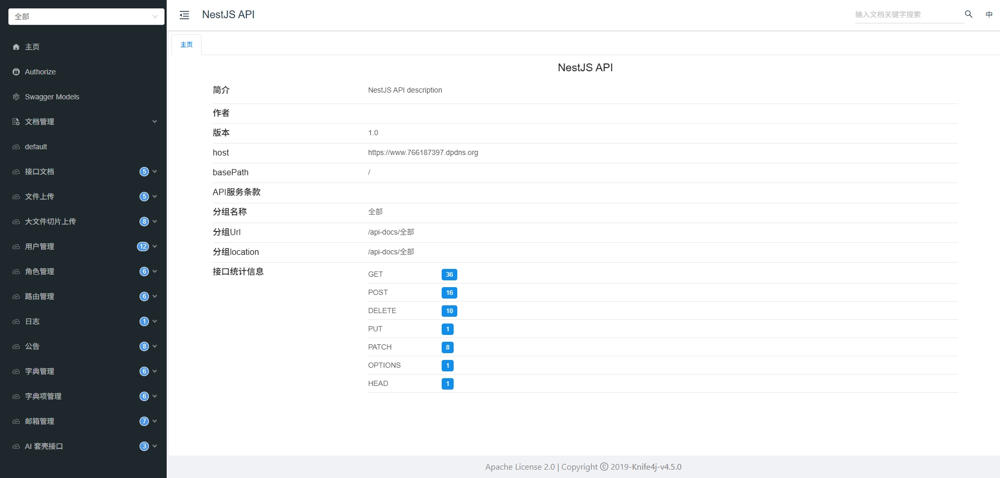
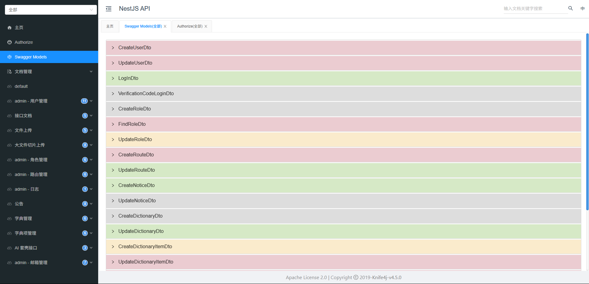

# nest-serve

> 使用nest开发的后端服务，可以对接不同的平台
>
> 预览地址：https://www.766187397.dpdns.org


## 项目介绍

> 使用zread.ai生成的项目介绍

[![zread](https://img.shields.io/badge/Ask_Zread-_.svg?style=flat&color=00b0aa&labelColor=000000&logo=data%3Aimage%2Fsvg%2Bxml%3Bbase64%2CPHN2ZyB3aWR0aD0iMTYiIGhlaWdodD0iMTYiIHZpZXdCb3g9IjAgMCAxNiAxNiIgZmlsbD0ibm9uZSIgeG1sbnM9Imh0dHA6Ly93d3cudzMub3JnLzIwMDAvc3ZnIj4KPHBhdGggZD0iTTQuOTYxNTYgMS42MDAxSDIuMjQxNTZDMS44ODgxIDEuNjAwMSAxLjYwMTU2IDEuODg2NjQgMS42MDE1NiAyLjI0MDFWNC45NjAxQzEuNjAxNTYgNS4zMTM1NiAxLjg4ODEgNS42MDAxIDIuMjQxNTYgNS42MDAxSDQuOTYxNTZDNS4zMTUwMiA1LjYwMDEgNS42MDE1NiA1LjMxMzU2IDUuNjAxNTYgNC45NjAxVjIuMjQwMUM1LjYwMTU2IDEuODg2NjQgNS4zMTUwMiAxLjYwMDEgNC45NjE1NiAxLjYwMDFaIiBmaWxsPSIjZmZmIi8%2BCjxwYXRoIGQ9Ik00Ljk2MTU2IDEwLjM5OTlIMi4yNDE1NkMxLjg4ODEgMTAuMzk5OSAxLjYwMTU2IDEwLjY4NjQgMS42MDE1NiAxMS4wMzk5VjEzLjc1OTlDMS42MDE1NiAxNC4xMTM0IDEuODg4MSAxNC4zOTk5IDIuMjQxNTYgMTQuMzk5OUg0Ljk2MTU2QzUuMzE1MDIgMTQuMzk5OSA1LjYwMTU2IDE0LjExMzQgNS42MDE1NiAxMy43NTk5VjExLjAzOTlDNS42MDE1NiAxMC42ODY0IDUuMzE1MDIgMTAuMzk5OSA0Ljk2MTU2IDEwLjM5OTlaIiBmaWxsPSIjZmZmIi8%2BCjxwYXRoIGQ9Ik0xMy43NTg0IDEuNjAwMUgxMS4wMzg0QzEwLjY4NSAxLjYwMDEgMTAuMzk4NCAxLjg4NjY0IDEwLjM5ODQgMi4yNDAxVjQuOTYwMUMxMC4zOTg0IDUuMzEzNTYgMTAuNjg1IDUuNjAwMSAxMS4wMzg0IDUuNjAwMUgxMy43NTg0QzE0LjExMTkgNS42MDAxIDE0LjM5ODQgNS4zMTM1NiAxNC4zOTg0IDQuOTYwMVYyLjI0MDFDMTQuMzk4NCAxLjg4NjY0IDE0LjExMTkgMS42MDAxIDEzLjc1ODQgMS42MDAxWiIgZmlsbD0iI2ZmZiIvPgo8cGF0aCBkPSJNNCAxMkwxMiA0TDQgMTJaIiBmaWxsPSIjZmZmIi8%2BCjxwYXRoIGQ9Ik00IDEyTDEyIDQiIHN0cm9rZT0iI2ZmZiIgc3Ryb2tlLXdpZHRoPSIxLjUiIHN0cm9rZS1saW5lY2FwPSJyb3VuZCIvPgo8L3N2Zz4K&logoColor=ffffff)](https://zread.ai/766187397/nest-serve)


## 版本

node版本>=20


## 功能

- 用户管理
- 角色管理
- 路由管理
- 日志管理&定时任务清理
- 文件上传&大文件上传
- 数据字典
- 通知公告
- 邮箱管理
- API文档：knife4j&swagger


## 接口设计

> 自定义接口按照下面的规则开发，但是第三方库有单独的要则按照库的标准来
>
> 平台：当前平台的配置只写了这几个（admin、web、mini、app），如果需要增加修改jwt中的getPlatformJwtConfig

/api/v1/admin/*

- api：表示请求的接口
- v1：接口版本
- admin：平台
  - admin：后台
  - web：web端
  - mini：小程序
  - app：安卓/iOS等
- *：具体的模块接口
- 特殊后缀：后台还需要查询其他平台的数据，后台的大部分接口需要加上平台标识
  - all/:platform
  - info/:platform/:id
    - platform少见，一般使用id不会怎么使用platform
  - platform：admin/web/mini/app等


## 本地运行

### 安装依赖

> 使用镜像、加速器、vpn等可能出现安装失败

```bash
npm i
```


### 环境变量

> .env：开发版本（使用MySQL数据库）
>
> .env.sqlitedb：开发版本（使用sqlite数据库）

[环境变量配置示例](/doc/环境变量配置.md)

```bash
npm run serve

npm run serve:sqlitedb
```


### 打包运行

```bash
npm run build
npm run start:prod
```


### 运行成功

> 运行成功后在控制台会打印

```bash
当前环境为：.env.sqlitedb
server to http://localhost:3000
swagger to http://localhost:3000/swagger
knife4j to http://localhost:3000/doc.html
```

- server：根地址
- swagger：swagger文档
- knife4j：knife4j文档


## Docker部署

> 使用了GitHub自动化上传到了Docker hub

```
docker pull 766187397/nest-serve:latest
```


## 注意

### 时区

项目免费部署在国外的服务器，为了显示正常给启动命令加上了指定时区（国内的时区）："start": "cross-env TZ=Asia/Shanghai node dist/main",


### 缓存

没有找到免费的redis，项目暂时使用的node-cache


## 前端项目

gitee：https://gitee.com/sk20020228/admin-vue3-ts

GitHub：https://github.com/766187397/admin-vue3-ts


## 项目结构

```
nest-serve
├── knife4j/												knife4j接口文档静态页面
├── logs/														日志存储地址
├── sqlitedata/											sqlite数据文件
├── src/
│   ├── common/											公共模块
│   │   ├── decorator/							装饰器
│   │   ├── dto/										Dto
│   │   ├── entities/								entities
│   │   ├── filter/									过滤器
│   │   ├── interceptor/						拦截器
│   │   ├── middlewares/						中间件
│   │   ├── pipeTransform/					管道
│   │   ├── service/								服务
│   │   └── utils/									工具函数抽离文件夹
│   ├── config/
│   │   ├── jwt.ts									jwt配置
│   │   ├── logger.ts								日志配置
│   │   ├── multer.ts								文件上传配置
│   │   ├── swagger.ts							接口文档API
│   │   └── whiteList.ts						白名单文档
│   ├── module/
│   │   ├── auth/										授权模块
│   │   ├── default-data/						默认数据（生成默认数据方便使用）
│   │   ├── dictionary/							数据字典
│   │   ├── knife4j/								knife4j接口文档
│   │   ├── logger/									日志接口
│   │   ├── notice/									通知公告
│   │   ├── roles/									角色
│   │   ├── routes/									路由
│   │   ├── upload/									文件上传
│   │   └── users/									用户
│   ├── types/											类型抽离文件夹
│   ├── app.module.ts
│   └── main.ts
├── types/
│   └── global.d.ts
├── uploads/												文件上传存储位置
├── .env.dev
├── .env.prod
├── .env.sqlitedb
├── eslint.config.mjs
├── nest-cli.json
├── package-lock.json
├── package.json
├── README.md
├── tsconfig.build.json
└── tsconfig.json
```


## 截图





