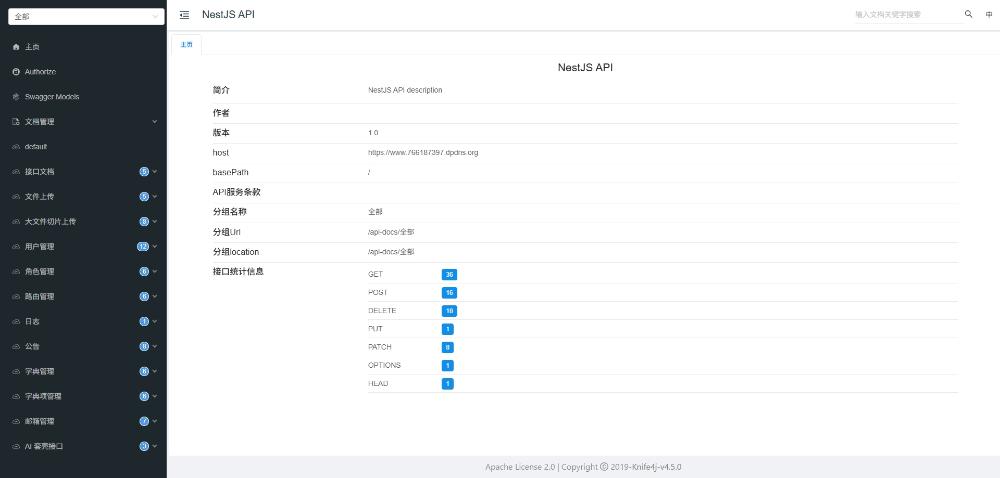
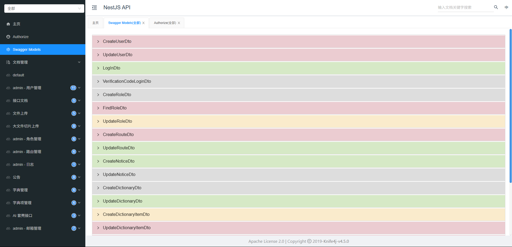

# nest-serve

> 使用nest开发的后端服务，可以对接不同的平台
>
> 预览地址：https://nest-serve.zeabur.app


## 项目介绍

> 使用zread.ai生成的项目介绍

[![zread](https://img.shields.io/badge/Ask_Zread-_.svg?style=flat&color=00b0aa&labelColor=000000&logo=data%3Aimage%2Fsvg%2Bxml%3Bbase64%2CPHN2ZyB3aWR0aD0iMTYiIGhlaWdodD0iMTYiIHZpZXdCb3g9IjAgMCAxNiAxNiIgZmlsbD0ibm9uZSIgeG1sbnM9Imh0dHA6Ly93d3cudzMub3JnLzIwMDAvc3ZnIj4KPHBhdGggZD0iTTQuOTYxNTYgMS42MDAxSDIuMjQxNTZDMS44ODgxIDEuNjAwMSAxLjYwMTU2IDEuODg2NjQgMS42MDE1NiAyLjI0MDFWNC45NjAxQzEuNjAxNTYgNS4zMTM1NiAxLjg4ODEgNS42MDAxIDIuMjQxNTYgNS42MDAxSDQuOTYxNTZDNS4zMTUwMiA1LjYwMDEgNS42MDE1NiA1LjMxMzU2IDUuNjAxNTYgNC45NjAxVjIuMjQwMUM1LjYwMTU2IDEuODg2NjQgNS4zMTUwMiAxLjYwMDEgNC45NjE1NiAxLjYwMDFaIiBmaWxsPSIjZmZmIi8%2BCjxwYXRoIGQ9Ik00Ljk2MTU2IDEwLjM5OTlIMi4yNDE1NkMxLjg4ODEgMTAuMzk5OSAxLjYwMTU2IDEwLjY4NjQgMS42MDE1NiAxMS4wMzk5VjEzLjc1OTlDMS42MDE1NiAxNC4xMTM0IDEuODg4MSAxNC4zOTk5IDIuMjQxNTYgMTQuMzk5OUg0Ljk2MTU2QzUuMzE1MDIgMTQuMzk5OSA1LjYwMTU2IDE0LjExMzQgNS42MDE1NiAxMy43NTk5VjExLjAzOTlDNS42MDE1NiAxMC42ODY0IDUuMzE1MDIgMTAuMzk5OSA0Ljk2MTU2IDEwLjM5OTlaIiBmaWxsPSIjZmZmIi8%2BCjxwYXRoIGQ9Ik0xMy43NTg0IDEuNjAwMUgxMS4wMzg0QzEwLjY4NSAxLjYwMDEgMTAuMzk4NCAxLjg4NjY0IDEwLjM5ODQgMi4yNDAxVjQuOTYwMUMxMC4zOTg0IDUuMzEzNTYgMTAuNjg1IDUuNjAwMSAxMS4wMzg0IDUuNjAwMUgxMy43NTg0QzE0LjExMTkgNS42MDAxIDE0LjM5ODQgNS4zMTM1NiAxNC4zOTg0IDQuOTYwMVYyLjI0MDFDMTQuMzk4NCAxLjg4NjY0IDE0LjExMTkgMS42MDAxIDEzLjc1ODQgMS42MDAxWiIgZmlsbD0iI2ZmZiIvPgo8cGF0aCBkPSJNNCAxMkwxMiA0TDQgMTJaIiBmaWxsPSIjZmZmIi8%2BCjxwYXRoIGQ9Ik00IDEyTDEyIDQiIHN0cm9rZT0iI2ZmZiIgc3Ryb2tlLXdpZHRoPSIxLjUiIHN0cm9rZS1saW5lY2FwPSJyb3VuZCIvPgo8L3N2Zz4K&logoColor=ffffff)](https://zread.ai/766187397/nest-serve)


## 版本

node版本>=20


## 功能

- 用户管理
- 角色管理
- 路由管理
- 日志管理&定时任务清理
- 文件上传&大文件上传
- 数据字典
- 通知公告
- 邮箱管理
- API文档：knife4j&swagger


## 接口设计

> 自定义接口按照下面的规则开发，但是第三方库有单独的要则按照库的标准来
>
> 平台：当前平台的配置只写了这几个（admin、web、mini、app），如果需要增加修改jwt中的getPlatformJwtConfig

### 接口路径规范

```
/api/v1/{platform}/{module}
```

### 路径组成

- **api**：表示请求的接口
- **v1**：接口版本号
- **platform**：平台标识
  - `admin`：后台管理系统
  - `web`：Web端应用
  - `mini`：小程序应用
  - `app`：移动端应用（Android/iOS）
- **module**：具体的模块接口

### 特殊接口标识

后台管理需要查询其他平台数据时，接口需要加上平台标识：

- `all/:platform` - 查询指定平台的所有数据
- `info/:platform/:id` - 查询指定平台的指定数据（较少使用）
- `platform` 参数值：admin/web/mini/app

### 示例

```
POST   /api/v1/admin/users          # 创建用户（后台管理）
GET    /api/v1/admin/users          # 查询用户列表（后台管理）
GET    /api/v1/admin/users/all/web  # 查询Web端所有用户（后台管理）
GET    /api/v1/web/users/profile    # 获取当前用户信息（Web端）
```


## 本地运行

### 安装依赖

> 使用镜像、加速器、vpn等可能出现安装失败

```bash
npm i
```


### 环境变量

> .env：开发版本（使用MySQL数据库）
>
> .env.sqlitedb：开发版本（使用sqlite数据库）

[环境变量配置示例](/doc/环境变量配置.md)

```bash
npm run serve

npm run serve:sqlitedb
```


### 打包运行

```bash
npm run build
npm run start:prod
```


### 运行成功

> 运行成功后在控制台会打印

```bash
当前环境为：.env.sqlitedb
server to http://localhost:3000
swagger to http://localhost:3000/swagger
knife4j to http://localhost:3000/doc.html
```

- server：根地址
- swagger：swagger文档
- knife4j：knife4j文档


## Docker部署

> 使用了GitHub自动化上传到了Docker hub

```
docker pull 766187397/nest-serve:latest
```


## 注意

### 时区

项目免费部署在国外的服务器，为了显示正常给启动命令加上了指定时区（国内的时区）："start": "cross-env TZ=Asia/Shanghai node dist/main",


### 缓存

没有找到免费的redis，项目暂时使用的node-cache


## 前端项目

gitee：https://gitee.com/sk20020228/admin-vue3-ts

GitHub：https://github.com/766187397/admin-vue3-ts


## 项目结构

```
nest-serve
├── doc/                          # 项目文档
├── knife4j/                      # knife4j接口文档静态页面
├── logs/                         # 日志存储地址
├── sqlitedata/                   # sqlite数据文件
├── src/
│   ├── common/                   # 公共模块
│   │   ├── constants/            # 常量定义
│   │   ├── decorators/           # 自定义装饰器
│   │   ├── dto/                  # 通用DTO
│   │   ├── entities/             # 通用实体
│   │   ├── exceptions/           # 自定义异常
│   │   ├── filters/              # 异常过滤器
│   │   ├── guards/               # 守卫
│   │   ├── interceptors/         # 拦截器
│   │   ├── pipes/                # 管道
│   │   └── utils/                # 工具函数
│   ├── config/                   # 配置文件
│   │   ├── db.ts                 # 数据库配置
│   │   ├── jwt.ts                # JWT配置
│   │   ├── logger.ts             # 日志配置
│   │   ├── multer.ts             # 文件上传配置
│   │   ├── redis.ts              # Redis配置
│   │   ├── swagger.ts            # 接口文档配置
│   │   ├── whiteList.ts          # 白名单配置
│   │   └── winston.ts            # Winston日志配置
│   ├── modules/                  # 业务模块
│   │   ├── auth/                 # 认证授权模块
│   │   ├── cache/                # 缓存模块
│   │   ├── concurrency-control/  # 并发控制模块
│   │   ├── config-management/    # 配置管理模块
│   │   ├── connection-pool-monitor/ # 连接池监控模块
│   │   ├── database-optimization/ # 数据库优化模块
│   │   ├── defaultData/          # 默认数据模块
│   │   ├── dictionary/           # 数据字典模块
│   │   ├── doc/                  # 文档模块
│   │   ├── email/                # 邮箱管理模块
│   │   ├── event-driven/         # 事件驱动模块
│   │   ├── exception-test/       # 异常测试模块
│   │   ├── logger/               # 日志管理模块
│   │   ├── notice/               # 通知公告模块
│   │   ├── performance-monitor/  # 性能监控模块
│   │   ├── roles/                # 角色管理模块
│   │   ├── routes/               # 路由管理模块
│   │   ├── schedule/             # 定时任务模块
│   │   ├── upload/               # 文件上传模块
│   │   └── users/                # 用户管理模块
│   ├── types/                    # 类型定义
│   ├── app.module.ts             # 根模块
│   └── main.ts                   # 入口文件
├── types/                        # 全局类型定义
│   └── global.d.ts
├── uploads/                      # 文件上传存储位置
├── .env.dev                      # 开发环境配置
├── .env.prod                     # 生产环境配置
├── .env.sqlitedb                 # SQLite环境配置
├── eslint.config.mjs             # ESLint配置
├── nest-cli.json                 # NestJS CLI配置
├── package-lock.json
├── package.json
├── README.md
├── tsconfig.build.json           # TypeScript构建配置
└── tsconfig.json                 # TypeScript配置
```


## 截图





